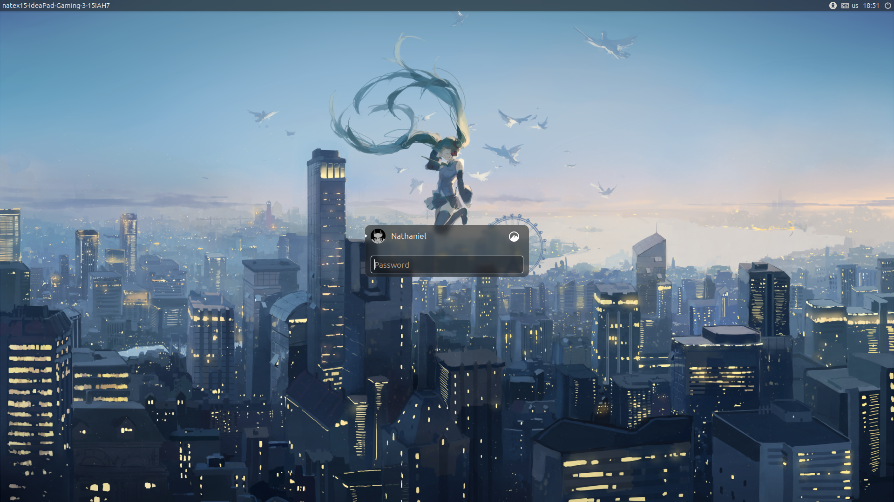
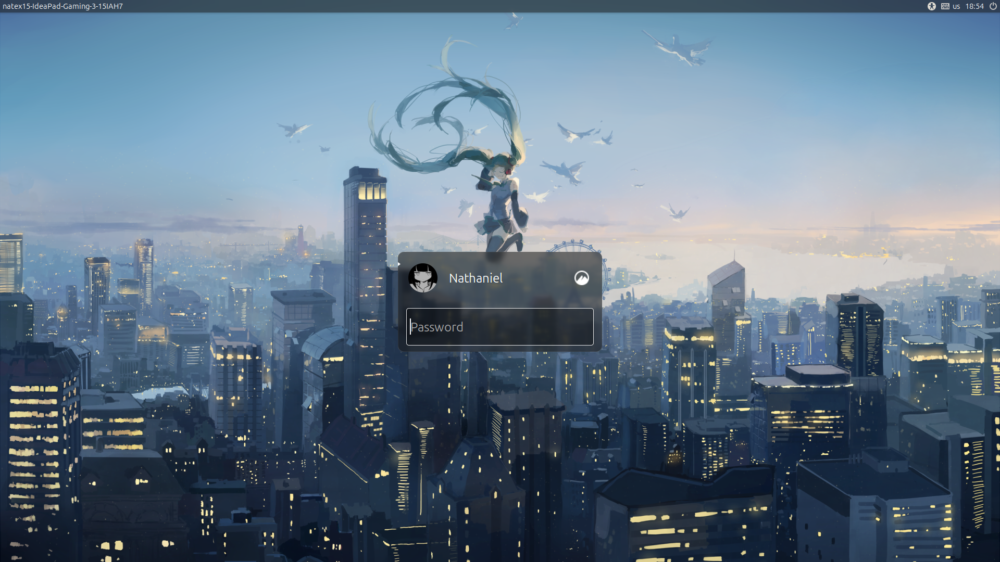

# Slick-Greeter Large UI (Linux Mint)

A clean, reproducible modification and build tool for **Linux Mint's Slick-Greeter** that scales up the login interface (larger avatar, larger typography, spacious password entry, and balanced control scaling) while preserving the native **Mint-Y-Aqua** visual design.

---

## Visual Overview

| Stock Slick-Greeter (Before) | Large UI Mod (After) |
| :---: | :---: |
|  |  |
| *(Stock UI: 360px box, 32px avatar, 13-14pt fonts)* | *(Large UI: 400px box, 56px avatar, 72px entry, 17-20pt fonts)* |

---

## Features & UI Dimension Differences

The mod scales the greeter elements proportionally so that a spacious password field fits harmoniously with the user's avatar, username, and session controls.

| UI Element | Stock Slick-Greeter | Large UI Mod | Description / Intent |
| :--- | :--- | :--- | :--- |
| **Login Box Width** | `9` blocks (~360px) | `10` blocks (~400px) | More breathing room for usernames and inputs |
| **Main Avatar** | `32px` | `56px` | Prominent centered profile photo |
| **Condensed User List Avatar** | `32px` | `32px` | Compact user switcher remains compact |
| **Main Avatar Margins** | `top: auto`, `right: 6px` | `top: 0`, `left: 4px`, `right: 6px` | Centered alignment in name grid |
| **Main Username Label** | `Ubuntu 13`, `grid_size` (40px) | `Ubuntu 18`, `64px` height | Clear, high-contrast readable username |
| **Password Input Font** | `Ubuntu 14` | `Ubuntu 20` | Large, legible password entry font |
| **Password Input Height** | Default (~40px) | `72px` minimum height | Comfortable touch/click target |
| **Password Placeholder Font** | `Ubuntu 13` | `Ubuntu 18` | Proportionally sized placeholder text |
| **Main Grid Spacing** | `4px` col / `3px` row | `8px` col / `8px` row | Relaxed control spacing |
| **Message / Mail Icon** | Default button size | `20px` (condensed `18px`) | Crisp icon rendering |
| **Session Options Button** | Default | `44x60px` box, `28x28px` icon | Scaled session/gear button |
| **Login Action Button** | `Ubuntu 13`, `6x8px` pad | `Ubuntu 17`, `10x14px` pad | Scaled text, chevron icon `24x24px` |
| **Compact User List Text** | `Ubuntu 13`, `margin_left: 2` | `Ubuntu 14`, `margin_left: 6` | Subtle legibility boost in switcher |

---

## Supported Versions

| Operating System | Release Codename | Base Slick-Greeter Version | Support Status |
| :--- | :--- | :--- | :--- |
| **Linux Mint 22.3** | `zena` | `2.2.6+zena` | ✅ **Fully Supported & Tested** |
| Linux Mint 22.x | `wilma` / `xia` | Other revisions | ⚠️ Verify patch offsets first |

> [!NOTE]
> The installer checks your system's package version before making any modifications. If an unsupported version is detected, it will safely abort and provide instructions on how to verify compatibility.

---

## Quick Start

### 1. Clone the Repository

```bash
git clone https://github.com/Natex15/slick-greeter-large-ui.git
cd slick-greeter-large-ui
```

### 2. Run the Installer

```bash
./scripts/install.sh
```

To set a custom wallpaper during installation:

```bash
./scripts/install.sh --wallpaper /path/to/your/wallpaper.png
```

### 3. Verify Installation

```bash
./scripts/verify.sh
```

### 4. Test the Greeter

You can preview the greeter in a window without logging out:

```bash
slick-greeter --test-mode
```

---

## How It Works

Instead of maintaining a massive fork of the entire Linux Mint source tree, this repository uses an automated patch-and-build workflow:

```
┌─────────────────────────┐
│  Check OS & Base Version│
└────────────┬────────────┘
             ▼
┌─────────────────────────┐
│ Fetch Pristine Source   │  (via 'apt source slick-greeter')
└────────────┬────────────┘
             ▼
┌─────────────────────────┐
│ Apply Large UI Patch    │  (patches/large-login-ui.patch)
└────────────┬────────────┘
             ▼
┌─────────────────────────┐
│ Build Local .deb Package│  (dpkg-buildpackage with clean revision)
└────────────┬────────────┘
             ▼
┌─────────────────────────┐
│ Install Package Safely  │  (sudo dpkg -i)
└────────────┬────────────┘
             ▼
┌─────────────────────────┐
│ Validate LightDM Config │  (verify greeter-session=slick-greeter)
└─────────────────────────┘
```

---

## Configuration & Wallpaper

Slick-Greeter configuration is stored at `/etc/lightdm/slick-greeter.conf`.

### Default Behavior
- Running `./scripts/install.sh` **never** overwrites your existing `/etc/lightdm/slick-greeter.conf`.
- If no configuration file exists, the greeter uses the system defaults.

### Using the Example Configuration
A template configuration is provided in `config/slick-greeter.conf.example`. You can copy and edit it:

```bash
sudo cp config/slick-greeter.conf.example /etc/lightdm/slick-greeter.conf
sudo nano /etc/lightdm/slick-greeter.conf
```

### Setting Wallpaper via Installer
```bash
./scripts/install.sh --wallpaper /usr/share/backgrounds/linuxmint/my-wallpaper.png
```

---

## Uninstallation / Rollback

To remove the custom build and restore the stock official Linux Mint package:

```bash
./scripts/uninstall.sh
```

The uninstaller:
1. Re-installs the official stock `slick-greeter` package from Linux Mint APT repositories.
2. Preserves your existing `/etc/lightdm/slick-greeter.conf` and wallpaper settings.
3. Runs `verify.sh` to confirm the display manager remains healthy.

---

## Idempotency and Re-Runs

The installation script is designed to be fully idempotent:
- If a build was interrupted or re-run, existing downloaded source is reused.
- If the patch is already applied in the build directory, the script detects it and skips re-application without erroring.
- If the target package version is already installed, the installer automatically increments the local revision suffix.

---

## Handling Upstream Updates

When Linux Mint releases package updates via Update Manager or `apt upgrade`, the system may replace your custom build if a newer upstream version becomes available (e.g. `2.2.8`).

### To Lock / Hold the Custom Package:
```bash
sudo apt-mark hold slick-greeter
```

### To Unhold When You Wish to Upgrade:
```bash
sudo apt-mark unhold slick-greeter
```

### Updating the Patch for a Newer Slick-Greeter Version:
1. Obtain the new version's source:
   ```bash
   apt source slick-greeter
   ```
2. Test the patch against the new source:
   ```bash
   cd slick-greeter-<new-version>
   patch -p1 --dry-run < /path/to/patches/large-login-ui.patch
   ```
3. If all hunks succeed with zero errors, update `SUPPORTED_VERSION` in `scripts/install.sh`.
4. If hunks fail due to upstream line changes, adjust the patch context and regenerate `patches/large-login-ui.patch`.

---

## Troubleshooting

### Greeter does not load or black screen on boot
- Boot into a TTY using `Ctrl + Alt + F2`.
- Log in with your username and password.
- Run `slick-greeter --test-mode` to check for syntax/library errors.
- Run `./scripts/uninstall.sh` to immediately restore the stock package.

### Missing `deb-src` error
If `apt source slick-greeter` fails:
1. Open **Software Sources** (`mintsources`) from the application menu.
2. Ensure **Source code repositories** is enabled.
3. Or verify that `deb-src` entries exist in `/etc/apt/sources.list.d/official-package-repositories.list`.
4. Run `sudo apt update` and re-run `./scripts/install.sh`.

---

## License & Attribution

- **Patch & Build Tooling**: Licensed under the [GNU General Public License v3.0](LICENSE).
- **Upstream Slick-Greeter**: Copyright © Linux Mint and original contributors. Project repository: [linuxmint/slick-greeter](https://github.com/linuxmint/slick-greeter).
